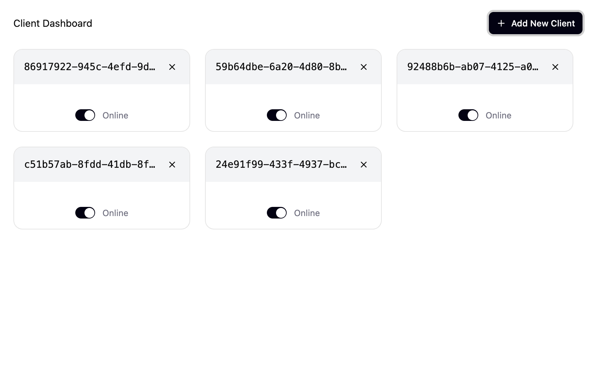

# Add a client to the dashboard

## Description

Implement the functionality to dynamically add and display client instances within the dashboard using iframes, as described in the main README. The dashboard serves as the main application entry point that allows loading client instances. Each client is loaded as an iframe pointing to the separate client entry point (`/client.html`), with communication between dashboard and clients via postMessage API. The iframes should be displayed as compact cards in a responsive grid layout that adapts to window width, as shown in the design.

## Design



## Requirements

### iframe Implementation

- Each client must be loaded in an iframe pointing to `/client.html`
- iframes must have no visible styling (transparent borders, no scroll bars)
- iframe containers styled as cards to match the design mockup
- iframes must be sized to exactly match the card dimensions shown in design

### Layout Requirements

- Responsive CSS Grid layout that adapts to viewport width
- Cards arranged from left to right in row-major order
- Grid uses `auto-fill` to accommodate different screen sizes
- Minimum card width of 280px with appropriate gap spacing

### Communication Requirements

- Use `window.postMessage` API for cross-frame communication
- Client iframes send `CLOSE_CLIENT` messages to parent dashboard
- Dashboard listens for messages and updates state accordingly
- Dashboard generates unique client IDs and passes them to iframes via URL parameter
- Clients must use the ID provided by the dashboard (not generate their own)

### State Management Requirements

- Dashboard tracks active clients with unique IDs
- Add New Client button creates new client instances
- Client removal handled via postMessage from iframe
- Empty state displayed when no clients exist

## Implementation

### iframe Architecture

- Dashboard generates unique client IDs and creates iframe elements pointing to `/client.html?clientId=${id}`
- Each client reads its ID from URL parameters provided by the dashboard
- iframe containers styled as cards with gray background and rounded corners
- Communication between dashboard and clients via postMessage API

### Client-side Implementation (in iframe)

```typescript
const handleClose = () => {
  window.parent.postMessage({
    type: 'CLOSE_CLIENT',
    clientId: client.id
  }, '*');
};
```

### Dashboard-side Implementation (parent window)

```typescript
useEffect(() => {
  const handleClientMessage = (event: MessageEvent) => {
    if (event.origin !== window.location.origin) return;
    
    const { type, clientId } = event.data;
    if (type === 'CLOSE_CLIENT') {
      removeClient(clientId);
    }
  };
  
  window.addEventListener('message', handleClientMessage);
  return () => window.removeEventListener('message', handleClientMessage);
}, []);
```

## Checklist

### Basic Implementation

- [x] Analyze existing dashboard structure and client-related code
- [x] Update Dashboard state management to track active clients
- [x] Implement Add Client functionality with iframe integration
- [x] Create responsive grid layout matching design specifications
- [x] Add Client management features (removal via postMessage)
- [x] Set up iframe communication with postMessage API
- [x] Pass client ID to iframe via URL parameter

### iframe Styling Requirements

- [x] Style iframe containers as cards to match design mockup
- [x] Ensure iframes have no visible borders or scroll bars
- [x] Size iframes to exactly match card dimensions from design
- [x] Verify iframe content fits properly within card containers

### Layout Polish

- [x] Test responsive layout behavior across different viewport widths
- [x] Verify minimum card width of 280px is enforced
- [x] Ensure proper gap spacing between cards
- [x] Test grid behavior with various numbers of clients

### Final Testing

- [x] Test iframe communication (close functionality)
- [x] Verify empty state displays correctly
- [x] Smoke test complete functionality with all requirements met
