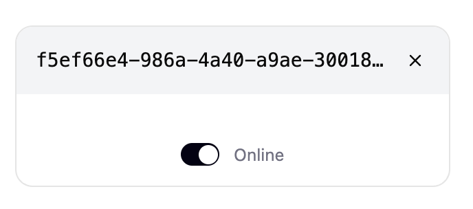

# Add client ui

## Description

Create user interface for the client instance (/client.html) that will be loaded in iframes by the dashboard, supporting the SharedWorker communication architecture. Will use Radix UI primitives for accessible, unstyled components with CSS modules for styling.

## Design



**Key UI Elements:**

- **Header**: Dynamic title showing "Client" + first 6-8 characters of UUID (e.g., "Client 255e6e...") with close button (X).
- **Status Section**: "Status:" label with connection status badge ("Online"/"Offline").
- **Toggle Switch**: For controlling connection state.
- **ID Display**: Full client UUID shown in gray container.
- **Card Layout**: Clean, contained design with proper spacing.
- **Card Width**: 250px.

## Steps

- [x] Install Radix UI primitive components.
- [x] Set up CSS modules for component styling.
- [x] Configure Vite for CSS modules support.
- [x] Design client interface layout.
- [x] Create UI components for the client using Radix UI.
- [x] Add connection status display.
- [x] Add client controls and information display.
- [x] Style the client interface with CSS modules.
- [x] Test client functionality in iframe context.

## Notes

This will create the client interface that runs inside iframes and connects to the SharedWorker for testing port disconnection scenarios. Focus is on the client-side UI only.

### Radix UI Setup Requirements

- Install individual Radix UI primitive packages as needed.
- Configure Vite for CSS modules support (.module.css files).
- Set up TypeScript declarations for CSS modules.
- Create custom styled wrappers around Radix primitives using CSS modules.

### Potential Radix UI Components Needed

- @radix-ui/react-button (for client controls).
- @radix-ui/react-badge (for connection status indicators).
- @radix-ui/react-separator (for layout organization).
- @radix-ui/react-card or custom card component (for information display).
- @radix-ui/react-progress (for connection/activity indicators).

### Directory Structure

```
features/
└── client/
    ├── components/
    ├── types.ts
    └── ClientApp.tsx
```

**Structure:**

- **`components/`** - Client UI components with their CSS modules.
- **`types.ts`** - TypeScript interfaces for the client feature.
- **`ClientApp.tsx`** - Main component that orchestrates everything.
