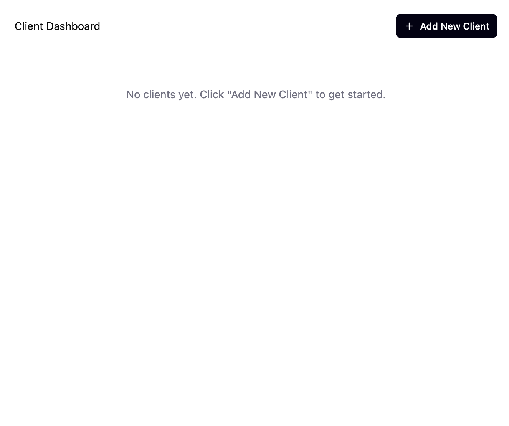

# Dashboard layout (no iframe integration)

## Description

Create a dashboard layout component that provides a structured interface for displaying various sections and content areas. This task focuses on building the visual layout structure without implementing iframe integration functionality.

## Design

The design shows a clean, minimal dashboard layout with the following key elements:

**Header Section:**

- Left side: "Client Dashboard" title in large, bold text.
- Right side: Dark rounded button with "+" icon and "Add New Client" text.

**Main Content Area:**

- Centered empty state message: "No clients yet. Click 'Add New Client' to get started." in gray text.
- Clean white background with plenty of whitespace.
- Simple, uncluttered layout focused on the call-to-action.

**Design Characteristics:**

- Minimalist approach with lots of white space.
- High contrast between dark button and light background.
- Typography appears to use a modern sans-serif font.
- Responsive-friendly layout with centered content.
- Empty state design that guides user to the primary action.

## Checklist

- [x] Analyze existing codebase structure and components.
- [x] Create dashboard feature directory structure.
- [x] Implement dashboard header with title and "Add New Client" button.
- [x] Create main content area with centered empty state.
- [x] Add empty state message and styling.
- [x] Implement responsive layout with proper spacing.
- [x] Style dashboard with CSS modules following design specs.
- [x] Add typography and color scheme matching the design.
- [x] Test the dashboard layout in development environment.
- [x] Update main app to use dashboard component.
- [x] Verify the new feature looks and works as expected.
- [x] Smoke test the application manually.
