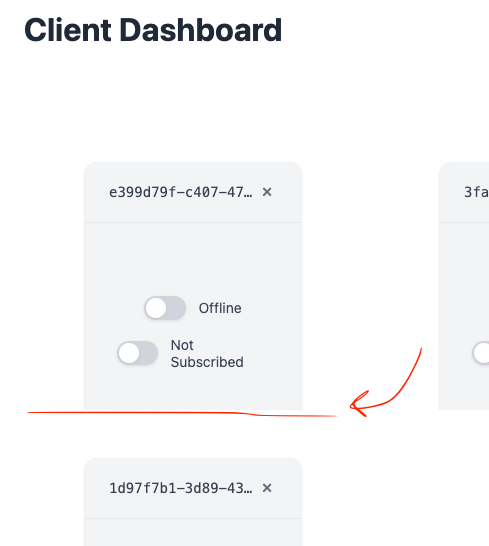

# Standalone client (/client.html) should have max width and rounded corners

## Description

Improve the styling of the standalone client page at `/client.html` by adding a maximum width constraint and rounded corners to make it visually more appealing and prevent it from stretching too wide on large screens.

When a client is in the dashboard, the styling should come from the client and not from the dashboard.

A client should look the same when viewed in the dashboard and when viewed standalone (/client.html).

## Checklist

- [x] Examine current `/client.html` page structure and styling.
- [x] Add max-width constraint to the main container.
- [x] Add rounded corners to appropriate elements.
- [x] Test the changes in the browser.
- [x] Ensure responsive behavior is maintained.

## Review Notes

### Round 1

;

- [x] There is a gray background when the dashboard is in the client, remove it.
- [x] the rounded corners should be applied to the standalone client, not the container in the dashboard.
- [x] The standalone client should have a light gray background.

### Round 2

- [x] The client should look the same when viewed in the dashboard and when viewed standalone (/client.html). see , I want the standalone client to look like the client in the dashboard.

### Round 3

- [x] see Styling Approach Summary below.

### Round 4

- [x] fix client cutoff in dashboard, see . The client should not be cut off in the dashboard, it should be fully visible.

## Styling Approach Summary

**Initial Approach (Overcomplicated):**

- Used iframe detection (`window.self !== window.top`) to conditionally apply different styles
- Dashboard provided gray background and rounded corners via `.clientCard`
- Client had different styling when standalone vs embedded
- Required wrapper divs and complex conditional logic

**Final Approach (Clean & Simple):**

- Client is completely self-contained with all styling in `ClientApp.module.css`
- Fixed dimensions: 280px × 280px with gray background (`#f3f4f6`) and rounded corners
- Dashboard just provides a simple iframe container sized exactly to fit (280px × 280px)
- No conditional styling, no iframe detection, no wrapper logic needed
- Client looks identical everywhere because it's truly self-contained

**Key Insight:** Instead of making the dashboard provide styling and then trying to replicate it for standalone, make the client provide its own styling and let the dashboard just be a simple container.
