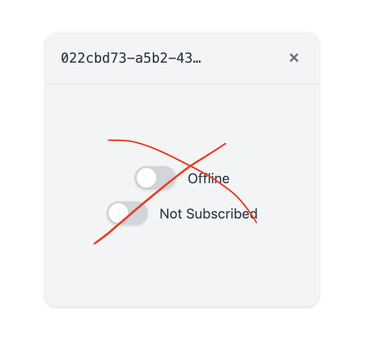

# Remove switches and RPC layer (prep for full RPC rewrite)

## Description

Remove the switch toggles from the client UI and the entire RPC layer in preparation for a full RPC rewrite. Keep only the core UI components: dashboard, client display, and the ability to load standalone clients in /client.html and embed them in the dashboard.

See 

## Checklist

- [x] Remove entire src/rpc/ directory
- [x] Remove jotai and comlink dependencies from package.json
- [x] Simplify ClientApp.tsx (remove switches, RPC, subscriptions)
- [x] Remove switch-related CSS styles from ClientApp.module.css
- [x] Test that simplified client renders correctly
- [x] Test standalone client loading still works
- [x] Commit the changes now
- [x] Remove the counter from the client as well
