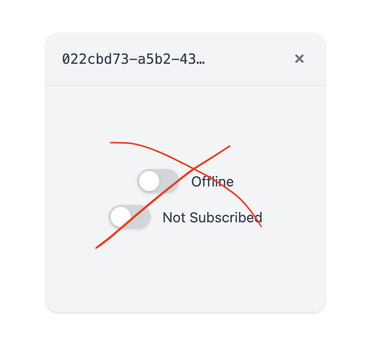

# Remove switches and RPC layer (prep for full RPC rewrite)

## Description

Remove the switch toggles from the client UI and the entire RPC layer in preparation for a full RPC rewrite. Keep only the core UI components: dashboard, client display, and the ability to load standalone clients in /client.html and embed them in the dashboard.

See 

## Checklist

- [ ] Remove entire src/rpc/ directory
- [ ] Remove jotai and comlink dependencies from package.json
- [ ] Simplify ClientApp.tsx (remove switches, RPC, subscriptions)
- [ ] Remove switch-related CSS styles from ClientApp.module.css
- [ ] Test that simplified client renders correctly
- [ ] Test standalone client loading still works
- [ ] Commit the changes now
