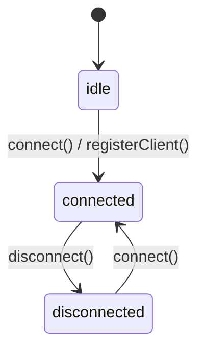

# Implement SharedWorker-based RPC communication using Comlink

## Description

Implement a SharedWorker-based RPC (Remote Procedure Call) communication system using Comlink to enable communication between the dashboard and client iframes. This creates a shared worker that can manage client registration and provide RPC services across multiple client instances.

## Checklist

- [x] Install Comlink and Jotai dependencies
- [x] Create RPC types and contract interface (`src/rpc/types.ts`)
- [x] Implement SharedWorker with Comlink (`src/rpc/worker.ts`)
  - [x] ComlinkWorker class with registerClient and echo methods
  - [x] Client registration using navigator locks
  - [x] SharedWorker event handling for port connections
- [x] Implement RPC client wrapper (`src/rpc/client.ts`)
  - [x] SharedWorker initialization with Comlink
  - [x] Generate unique client ID using crypto.randomUUID()
  - [x] Client registration with navigator locks
  - [x] Export rpcClient for use across components
- [x] Update TypeScript configuration
  - [x] Add WebWorker lib support for SharedWorker types
- [x] Refactor ClientApp component
  - [x] Distinguish between internal RPC clientId and external dashboard clientId
  - [x] Use RPC-generated clientId for display
  - [x] Simplify state management (remove ClientState type)
  - [x] Conditional close button based on externalId presence
- [x] Update Dashboard component
  - [x] Import RPC client to initialize system
  - [x] Remove createdAt from Client interface
  - [x] Use externalId parameter for iframe URLs
- [x] Code formatting improvements
  - [x] Consistent quote usage (double quotes)
  - [x] Proper semicolon usage
  - [x] Improved code formatting across components
- [x] Update project backlog with new tasks
- [x] Design and document connection state machine with connect/disconnect API
- [ ] Create Jotai atoms for connection state management
  - [ ] Base connection state atom (idle/connected/disconnected)
  - [ ] State transition atom with side effects
  - [ ] Derived atom for connection status
- [ ] Refactor RPC client API
  - [ ] Remove module-level registration call
  - [ ] Implement connect() function with state machine integration
  - [ ] Implement disconnect() function
  - [ ] Export clean API (connect, disconnect, clientId)
- [ ] Update ClientApp to use new connect/disconnect API
- [ ] Test state machine behavior (registration only on first connect)

## Implementation Notes

The RPC system uses SharedWorker to enable communication between multiple client iframes and the dashboard. Each client gets a unique ID from the RPC system and registers itself using navigator locks. The dashboard passes an external ID to distinguish between different client instances while the RPC system manages internal client identification.

## Connection State Machine

The client connection follows a state machine pattern to ensure registration only happens once:



- **idle**: Initial state before first connection
- **connected**: Client is connected and active
- **disconnected**: Client is disconnected but previously registered
- **registerClient() side effect**: Only triggered on the first `idle → connected` transition

## Planned API Improvements

### Clean RPC Client API

Refactor `src/rpc/client.ts` to expose a cleaner API:

```typescript
// Proposed API
export function connect(): void;
export function disconnect(): void;
export const clientId: string;
```

### Implementation Plan

1. **Remove immediate registration**: Remove the module-level `navigator.locks.request` call
2. **Create Jotai store**: Implement connection state machine using Jotai atoms
3. **State-driven registration**: Move registration logic into the state transition (waiting → online)
4. **Export clean functions**: Provide `connect()` and `disconnect()` functions that update the state
5. **Hide complexity**: The Jotai abstraction handles state transitions and side effects internally

### Benefits

- **Clean API**: Simple `connect()`/`disconnect()` functions instead of boolean state
- **Single registration**: Registration only happens once, on first connect
- **Concurrent safe**: Jotai handles React's concurrent rendering properly
- **State machine clarity**: Clear state transitions with explicit side effects
